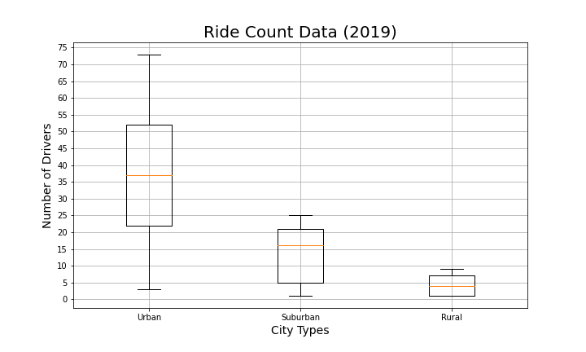

# PyBer_Analysis

## Overview
This analysis looks at PyBer data for January to April 2019 to determine trends in ridership and fares by city type. 

## Results
The urban market has the majority of both drivers and total fares.  The suburban market total fare is lower but proportional to its driver count.  The rural areas have fewer drivers but a larger porition of total fares due to higher relative fares.  

 

An analysis of the rides by city type shows the seasonality of the ridership does not vary significantly between the city types.  

## Summary
Based on the relatively low driver count and high profitablity of the rural market it would be worth exploring an expansion into this area.  The urban market remains strong due to higher availablity of drivers.  There is a statement summarizing three business recommendations to the CEO for addressing any disparities among the city types.
